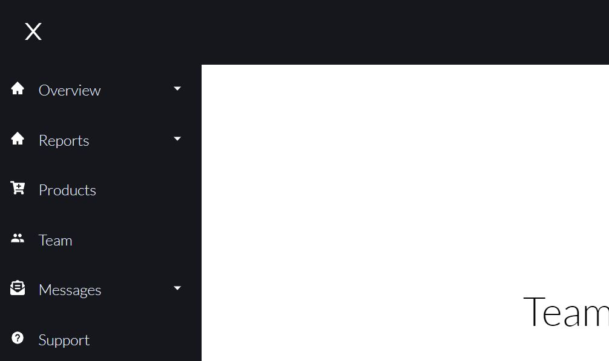

# Página web con dropdown sidebar

Desarrollado en React utilizado styled-components, react-router-dom y react-icons



Para instalar aplicacion ejecutar:

```
npm install
```

Para iniciar aplicacion ejecutar

```
npm start
```

------

Referencia de proyecto:

[Brian Design](https://www.youtube.com/channel/UCsKsymTY_4BYR-wytLjex7A)